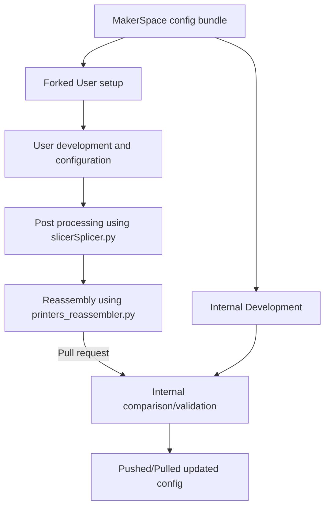

# SuperSlicer-config-splicer

This is a small python script to split the entire config bundle from SuperSlicer into its constituent profiles and configs.

It needs every section in the config to be flagged with the name of the relevant printer to place the section into the correct printer file at the end. Please use this script to split the SuperSlicer_config_bundle.ini file into its constituents to split them into the correct components after forking and developing and before putting in a pull request.

## Slicer Config Development Workflow

